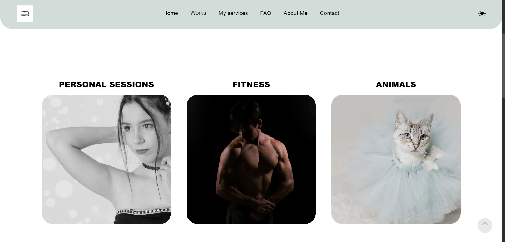
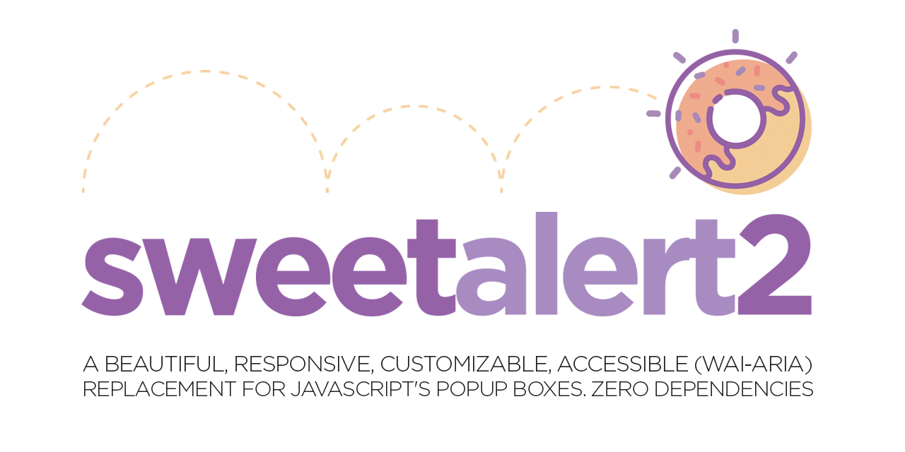
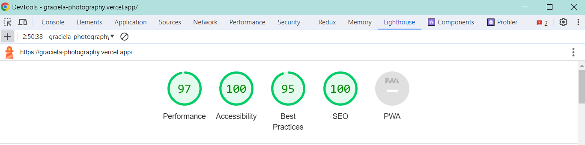

# Graciela photography - Freelancer project

## Frontend | Next.js / React / SCSS

 

  

 

**DEPLOY**:
 
https://graciela-photography.vercel.app

 

# Index

1. [Project title and developer's name](#graciela-photography---freelancer-frontend-developer)

1. [Description and functionalities](#description-and-functionalities)

1. [Technologies and Tools used](#technologies-and-tools-used)

1. [Lighthouse results](#lighthouse-results)

1. [Project status](#project-status)

1. [Project installation](#project-installation)

1. [Contribution](#contribution)

1. [Project developer](#project-developer)

 

## Description and functionalities

Graciela's photography is a **responsive** website for a professional photographer. The site comprises the following sections:

 

- **Home**

A **hero slider** with 6 slides gives users a preview and demonstration of the main content available on the page.

- **Works**

This section presents a comprehensive collection of **photo galleries**, including *Personal Sessions*, *Fitness*, *Animals*, *Pre-weddings*, *Weddings*, *Pregnant*, *Babies*, *Exterior*, and *Dance*.

When users click on any photo within a collection, it opens in a *Lightbox* view with the following functionalities:

• Display of the current photo number.
 
• Total count of photos in the collection.
 
• Showcase of the 5 nearby photos, facilitating easy navigation.
 
• Zoom in/out options for image size adjustment.
 
• Automatic playback for dynamic photo viewing.
 
• Full-screen mode.

- **About Me**

Explore **Graciela's portfolio**, which features a brief personal description, her background, the services she offers and a component guiding users to explore the **Works** section.

 

- **Why choose us?**

This section is dedicated to persuading potential customers. It includes details about the services offered, real customer reviews/testimonials, and once again, a component guiding users to the **Works** section.

- **FAQ**

This section compiles commonly asked questions and their corresponding answers, aiming to streamline and simplify interactions for the photographer.
 
If clients still have additional questions, a **Contact** form is available at the end of the section.

- **Contact**

A contact form is provided for direct communication with the client. Additionally, the photographer's contact information and a map with the location are included.

- **Theme Switch (Light/Dark)**

The navbar features an icon allowing users to switch between light and dark themes on the page.

 
 

## Technologies and Tools used

  
  
  
  
   
   
  
  
  
  
   
   
  
  
  

 
 

## Lighthouse results

  

 

## Project status

 

 

## Project installation

Before running this application, make sure you have the following dependencies installed:

- Node.js: [Download and install Node.js](https://nodejs.org)
- Git: [Download and install Git](https://git-scm.com/)

 

Once you have installed the dependencies, follow these steps to configure it:

1. Clone the repository: `git clone https://github.com/KevinVanDerSchans/gracielaPhotography.git`

2. Navigate to the project directory: `cd gracielaPhotography.git`

3. Install dependencies: `npm install`

4. Start a development server: `npm run dev`

 

## Contribution

If you want to contribute to this project, follow these steps:

1. Perform a fork to the repository.

2. Create a branch for your feature or bugfix: `git checkout -b feature/your-feature-name`

3. Make the necessary changes and commits:  `git commit -m 'Add some feature'`

4. Push to branch: `git push origin feature/your-feature-name`

5. Send a pull request to the original repository.

 

## Project developer

| [ Kevin Schans](https://github.com/KevinVanDerSchans) |
:------------------------------------------------------------------------------------------------------------------------------------------: |
